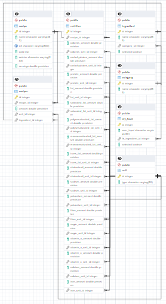

# Project Description: Recipe Finder
The intention of the web app is to be able to identify which recipees can be made based off of the contents of my fridge/pantry.
The web app is built using Django and PostgreSQL database. An Apache Airflow pipeline is currently being added to check and scrape
manali's website weekly for newly added recipes.

## Video of Functionality
Check out this video demonstration: [**recipe finder project video demo**](https://vimeo.com/819945402).

The video demo begins by displaying the 'Recipes' tab with two recipes that can be made using ingredients in 'My Food Table'. The user then adds ingredient items to two categories, 'Fruits' and 'Vegetables'. The video demonstrates that the selected items have been properly added to their respective categories in 'My Food Table'.

After returning to the 'Recipes' tab, the video shows that the number of available recipes has increased to six. The user then clicks on the recipe for 'Roasted Poha Chivda' to view its details, with the ingredient 'peanuts' highlighted as a requirement.

The user then navigates to the 'My Food' tab and deletes the 'peanuts' from the list by accessing the nut category. Upon returning to the 'Recipes' tab, the video shows that 'Roasted Poha Chivda' is no longer available as an option since one of its required ingredients is no longer in 'My Food Table'.

Finally, the user selects an available recipe and accesses a working list which directs them to the original recipe website.

## Table of Contents
- `scrapfun.py`: functions used to scrape raw html from my favorite recipe website, [Cook with Manali](https://www.cookwithmanali.com).
- `etl.py`: stores the raw data in PostgreSQL, parses the data to identify ingredients, amount, nutrition, cuisine, and units and store them in their respective tables in the database. 
- `models.py`: defines the database schema.
- `map.py`: stores recipe name, and url in postgreSql.
- `frontend_recipes_finder`: Built using Django, is a front-end editor that allows the user to add/delete items from their fridge & pantry. The ingredients are easily found by searching the appropriate category. A list of recipes is displayed when the recipes tab is selected from the side panel. SQLAlchemy advanced ORM is used to query the database.
- `pipeline.py`: working file, intended to process newly added recipes weekly.

## Entity Relationship Diagram (ERD)

  

