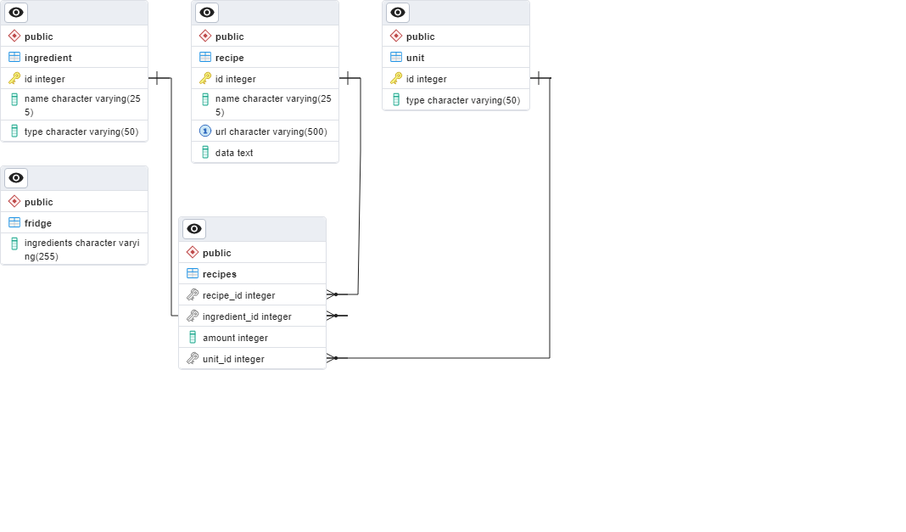

# Recipe Finder
The Recipe Finder is used to determine and recommend which recipes can be made from the contents of a kitchen. 

# Table of Contents
1. scrapfun.py - functions used to scrap scrape my favorite recipee website, [Cook with Manali](https://www.cookwithmanali.com) 
2. etl.py, models.py, map.py - stores the raw data, recipe name, and url in postgreSql server. The data is then parsed to identify ingredients, amount, and units and store them in their respective tables in the db. (see erd below)

The intention of the app is to be able to identify which recipees can be made based off of the 
contents of my fridge/pantry. I have decided to build an ELT pipeline so that I can add aditional information (cook time, prep time, cuisine, etc.) to the database 
without having to re-scrape. 
Project is ongoing, will continue updating.
